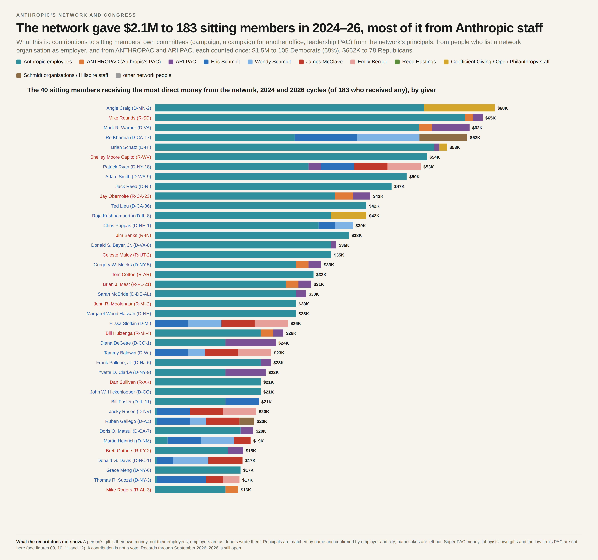

# Anthropic's network: direct money to sitting members of Congress, 2024–26

**What it shows.** Contributions to the committees of the 535 members of the 119th Congress from people and PACs in Anthropic's network, over the 2024 and 2026 election cycles. The committees are a member's campaign, a campaign for another office, and their leadership PAC. Each bar is one member, split by the giver:

- Anthropic employees
- ANTHROPAC (Anthropic's company PAC)
- ARI PAC (Americans for Responsible Innovation)
- five named principals: Eric Schmidt, Wendy Schmidt, James McClave, Emily Berger and Reed Hastings
- staff of Coefficient Giving / Open Philanthropy
- staff of Schmidt organisations / Hillspire
- other people who meet the network criteria (none remain in 2024–26 after the criteria below)

The figure shows the 40 members who received the most.

**In total.** $2,141,813 to 183 sitting members: $1.48M (69%) to 105 Democrats and $662K to 78 Republicans. Anthropic employees gave $1.31M of it, about 61%.

**What is not here.**
- Super PAC and other outside spending. It never reaches the member, and the committees' money is mostly not the network's.
- Lobbyists' personal contributions.
- Contributions to party committees, presidential campaigns or candidates who are not sitting members.

## Files

- `network-money-per-member.png`, `network-money-per-member.html` — the figure. The HTML carries the record ids of every contribution drawn.
- `data/contributions.csv` — one line per contribution drawn (739 lines). Columns:
  - member, party, chamber, state, district, bioguide id;
  - entity group and giver;
  - recipient committee and FEC committee id;
  - amount, date, cycle and kind;
  - FEC transaction (sub) id, source URL and record id.
- `data/member_totals_by_entity.csv` — the bar segments: member × entity group totals.

## Method

**Who counts as the network.** Membership follows written criteria: documented money (for example $50M+ or a named early investment in Anthropic, or $25M+ funding AI-safety or AI-policy organisations), control of vehicles, roles at Anthropic (officers, directors, trustees, registered lobbyists, advisory council) and grantmaking arms, each backed by a primary document. People who met no criterion, such as donors listed only as supporters of a network grantee with no amount, were removed on 2026-09-25.

Every line is an itemised FEC record. Individual contributions are FEC Schedule A receipts; PAC contributions are the PACs' Schedule B disbursements matched to the recipients' receipts. Each line was checked against the saved FEC record by an independent audit.

Each contribution is counted once. Excluded:
- memo entries;
- conduit pass-through records (ActBlue or WinRed transfers of the same gift);
- redesignations;
- copies of the same gift pulled twice.

People are placed in a group by the employer they wrote on the FEC form. Named principals are matched by name and confirmed by employer and city; namesakes are excluded, for example other people named Tom Brown, Chris Stewart and Steve Newman. Records run through September 2026, so the 2026 cycle is still open and its figures are floors.

**Names.** Only public people in public roles are named. Other individuals appear by group, such as "Anthropic employee". The FEC sub id in each line lets anyone look up the original public record at fec.gov.

## Caveats

- A person's contribution is their own money, not their employer's.
- ANTHROPAC's and ARI PAC's money comes from their members and is given by the PAC.
- A contribution is not a vote.
- Employer strings are self-reported, so group membership rests on what donors wrote.
